# **Appname:** *BLΛƆKMUSIƆ*  
## **Codename:** *RavenSYNTHA*  
 
 <h5>🎯 <i>Music Ultra Superior Integrated Catalog. A music player designed to deliver an unparalleled audio experience. BlackMusic integrates a vast catalog of music with superior playback capabilities.</i></h5> 

  

---
## 📑 Table of Contents  
1. [🎨 Gallery](#galleries)
2. [⚡ Features](#features)  
3. [📥 Download](#downloads)
4. [🖼️ Diagram](#diagram) 
5. [📜 License](#license)    
6. [🔒 Privacy Policy](#privacy-policy)  

## 🎨 Galleries   

## 📥 Download  
Download **BlackMusic** only from the source provided below. For your safety, avoid downloading from untrusted websites.

Available on:  
---

| Platforms | Mirrors 1 | Mirror 2 |
|-----------|-----------|----------|
|  | [Unavailable](#) | [Unavailable](#) |  
|  | [Unavailable](#) | [Unavailable](#) |  
|  | [Unavailable](#) | [Unavailable](#) |  
|  | [Unavailable](#) | [Unavailable](#) |  
|  | [Unavailable](#) | [Unavailable](#) |
<!--https://github.com/LoneStamp99/Vvdo/assets/93658802/2c26d1c7-b2dc-4e42-a3d7-f2ab25e88b45-->

App Version History

| 🧩 Icon | 🔢 Version       | ✨ Details on the Version Features Include                                                                                                                                                             | 🔗 Direct Link for Version Access                                           |
| ------- | ---------------- | ----------------------------------------------------------------------------------------------------------------------------------------------------------------------------------------------------- | --------------------------------------------------------------------------- |
|       | v1.1.01.001.0001 | - Initial release  - Functional: | [v1.1.01.001.0001](https://example.com/downloads/v1.1.01.001.0001) |

## Diagram (In Repo)

```mermaid
flowchart TB
    subgraph "Renderer Process (React UI)" 
        R1["src/index.tsx"] 
        R2["src/App.tsx"]
        R3["src/global.css"]
        R4["src/index.css"]
        R5["src/black-music-home.css"]
        R6["src/black-music-home.html"]
    end

    subgraph "Preload Bridge"
        P["src/preload.js"]
    end

    subgraph "Electron Main Process"
        M1["src/index.js"]
        M2["src/renderer.js"]
    end

    subgraph "Plugin/Module Loader"
        PL1[".app-registry/app-tx.js"]
        PL2[".app-registry/dependencies/commands/worker.js"]
        PL3[".app-registry/dependencies/commands/command.py"]
        PL4[".app-registry/systems/modules"]
    end

    subgraph "Native Addons"
        N1["binding.gyp"]
        N2["convert.cpp"]
        N3["convert.h"]
    end

    subgraph "Persistence (AppData)"
        D1["version-manifest.txt"]
        subgraph "core/data"
            C1["Ads: ads.txt, ads.xml"]
            C2["Languages: *.lng"]
            C3["Themes/default: *.themes"]
            C4["Metadata: metadata.xml"]
        end
        subgraph "backup"
            B1["backup.db"]
            B2["backup.sqlite"]
        end
    end

    subgraph "CI/CD & Packaging"
        CI1[".github/workflows/npm-grunt.yml"]
        CI2[".github/bmusic.yml"]
        CI3["Dockerfile"]
        CI4["docker-compose.yml"]
    end

    subgraph "Build & Transpile Config"
        B5[".babelrc"]
        B6["tsconfig.json"]
        B7["webpack.config.js"]
        B8["package.json"]
        B9["package-lock.json"]
    end

    R1 --> P
    R2 --> P
    R6 --> P
    P --> M1
    M1 --> PL1
    PL1 --> N1
    PL1 --> N2
    PL1 --> N3
    M1 --> D1
    CI1 --> B5
    CI2 --> B5

    click R1 "https://github.com/blackblazent/blackmusic/blob/main/src/index.tsx"
    click R2 "https://github.com/blackblazent/blackmusic/blob/main/src/App.tsx"
    click R3 "https://github.com/blackblazent/blackmusic/blob/main/src/global.css"
    click R4 "https://github.com/blackblazent/blackmusic/blob/main/src/index.css"
    click R5 "https://github.com/blackblazent/blackmusic/blob/main/src/black-music-home.css"
    click R6 "https://github.com/blackblazent/blackmusic/blob/main/src/black-music-home.html"
    click P "https://github.com/blackblazent/blackmusic/blob/main/src/preload.js"
    click M1 "https://github.com/blackblazent/blackmusic/blob/main/src/index.js"
    click M2 "https://github.com/blackblazent/blackmusic/blob/main/src/renderer.js"
    click PL1 "https://github.com/blackblazent/blackmusic/blob/main/.app-registry/app-tx.js"
    click PL2 "https://github.com/blackblazent/blackmusic/blob/main/.app-registry/dependencies/commands/worker.js"
    click PL3 "https://github.com/blackblazent/blackmusic/blob/main/.app-registry/dependencies/commands/command.py"
    click PL4 "https://github.com/blackblazent/blackmusic/tree/main/.app-registry/systems/modules"
    click N1 "https://github.com/blackblazent/blackmusic/blob/main/.app-registry/systems/modules/native_app/binding.gyp"
    click N2 "https://github.com/blackblazent/blackmusic/blob/main/.app-registry/systems/modules/native_app/configuration/convert.cpp"
    click N3 "https://github.com/blackblazent/blackmusic/blob/main/.app-registry/systems/modules/native_app/configuration/convert.h"
    click D1 "https://github.com/blackblazent/blackmusic/blob/main/AppData/1.1.01.001.0001/version-manifest.txt"
    click C1 "https://github.com/blackblazent/blackmusic/blob/main/AppData/bmusic/core/data/Ads/ads.txt"
    click C2 "https://github.com/blackblazent/blackmusic/tree/main/AppData/bmusic/core/data/Languages"
    click C3 "https://github.com/blackblazent/blackmusic/tree/main/AppData/bmusic/core/data/Themes/default"
    click C4 "https://github.com/blackblazent/blackmusic/blob/main/AppData/bmusic/core/data/Metadata/metadata.xml"
    click B1 "https://github.com/blackblazent/blackmusic/blob/main/AppData/bmusic/backup/backup.db"
    click B2 "https://github.com/blackblazent/blackmusic/blob/main/AppData/bmusic/backup/backup.sqlite"
    click CI1 "https://github.com/blackblazent/blackmusic/blob/main/.github/workflows/npm-grunt.yml"
    click CI2 "https://github.com/blackblazent/blackmusic/blob/main/.github/bmusic.yml"
    click CI3 "https://github.com/blackblazent/blackmusic/tree/main/Dockerfile"
    click CI4 "https://github.com/blackblazent/blackmusic/blob/main/docker-compose.yml"
    click B5 "https://github.com/blackblazent/blackmusic/blob/main/.babelrc"
    click B6 "https://github.com/blackblazent/blackmusic/blob/main/tsconfig.json"
    click B7 "https://github.com/blackblazent/blackmusic/blob/main/webpack.config.js"
    click B8 "https://github.com/blackblazent/blackmusic/blob/main/package.json"
    click B9 "https://github.com/blackblazent/blackmusic/blob/main/package-lock.json"

    classDef frontend fill:#ADD8E6,stroke:#000,stroke-width:1px
    classDef business fill:#90EE90,stroke:#000,stroke-width:1px
    classDef plugin fill:#FFFF99,stroke:#000,stroke-width:1px
    classDef native fill:#FFD700,stroke:#000,stroke-width:1px
    classDef persistence fill:#D2B48C,stroke:#000,stroke-width:1px
    classDef devops fill:#D3D3D3,stroke:#000,stroke-width:1px

    class R1,R2,R3,R4,R5,R6 frontend
    class P,M1,M2 business
    class PL1,PL2,PL3,PL4 plugin
    class N1,N2,N3 native
    class D1,C1,C2,C3,C4,B1,B2 persistence
    class CI1,CI2,CI3,CI4,B5,B6,B7,B8,B9 devops
```

## 📜 License  
<!--Этот проект находится под лицензией [CC BY-NC-ND 4.0 License](https://creativecommons.org/licenses/by-nc-nd/4.0/).-->  

  <a property="dct:title" rel="cc:attributionURL" href="https://github.com/LoneStamp/BlackMusic.git">BlackMusic</a> 
   
  is licensed under 
  <a href="https://creativecommons.org/licenses/by-nc-nd/4.0/?ref=chooser-v1" target="_blank" rel="license noopener noreferrer">
    CC BY-NC-ND 4.0 
     
     
     
    
  </a>

### 🔒 Privacy Policy and Terms of Service  
To learn more about how we collect, store and use user data, please read our [Privacy Policy](#).  
Our [Terms of Service](#) govern the use of **BlackMusic**. By using our app, you agree to these terms.

## 📅 Copyright  
© **BlackBlazent** 2025 All rights reserved.
